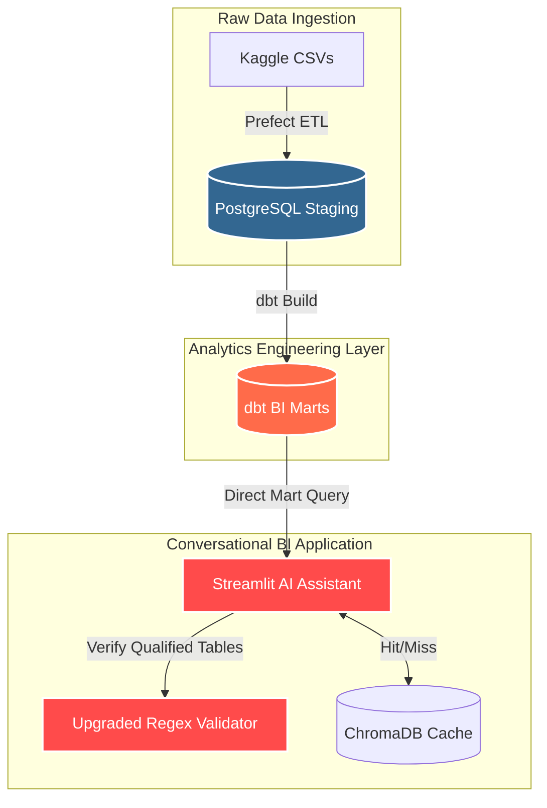

# Olist E-commerce Analytics Platform

> [!NOTE]
> **Consolidated Modern Data Stack Platform**
>
> This project is a unified platform created by merging three specialized systems into a production-grade Modern Data Stack (MDS):
> 1. [**olist-etl-pipeline**](https://github.com/Brightpmk/olist-etl-pipeline) — Data ingestion and validation.
> 2. [**olist-ecommerce-data-analysis**](https://github.com/Brightpmk/Basic_data-analysis-project_00) — KPI modeling and structured analytics.
> 3. [**ecommerce-ai-analytics-assistant**](https://github.com/Brightpmk/ecommerce-ai-analytics-assistant) — LLM-powered natural language interface.


An **end-to-end e-commerce analytics platform** built on the **Olist Brazilian E-commerce dataset**. This platform automates ingestion, validates schema constraints, generates analytics marts using dbt, secures query access via a restricted read-only database role, and exposes a Streamlit-based AI assistant with a high-performance semantic query cache.

---

## Architecture

```
                           [ Kaggle Raw CSVs ]
                                    │
                                    ▼
       ┌─────────────────────────────────────────────────────────┐
       │             PREFECT ORCHESTRATION ENGINE                │
       │                                                         │
       │ 1. Initialize DB Schema  ──►  (postgres superuser)      │
       │ 2. Extract & Validate CSVs                              │
       │ 3. Transform & Load Raw  ──►  [PostgreSQL (staging)]    │
       │ 4. Run dbt Build Marts   ──►  [PostgreSQL (public)]     │
       └─────────────────────────────────────────────────────────┘
                                     │
                                     ▼
                      ┌─────────────────────────────┐
                      │    POSTGRESQL WAREHOUSE     │
                      ├─────────────────────────────┤
                      │ staging.stg_* (Views)       │
                      │ public.dim_* (Marts)  ──┐   │
                      │ public.fact_* (Marts) ──┴───┐
                      └─────────────────────────────┤
                                                    │
                             ┌──────────────────────┘ (Bypasses staging layer)
                             │ Read-Only User
                             │ app_analytics_user
                             ▼
                      ┌──────┬──────────────────────┐
                      │    AI ANALYTICS FRONTEND    │
                      │  (Streamlit App / app.py)   │
                      └──────────────┬──────────────┘
                                    │
                            ┌───────┴───────┐
                            ▼               ▼
                    [ ChromaDB Cache ]   [ OpenAI API ]
                    (Cosine Dist < 0.1)  (gpt-4o-mini)
```

### Data Lineage (dbt DAG)
The transformation layer maps staging views to clean analytical dimension and fact marts according to the following DAG:

```
[stg_orders] ────────┐
                     ├───► [fact_orders]
[stg_customers] ─────┘
                     
[stg_order_items] ───┐
[stg_products] ──────┼───► [fact_sales]
[stg_sellers] ───────┘
```
*(To view the interactive, fully detailed lineage graph and model descriptions, run `dbt docs generate && dbt docs serve` from the `/dbt` folder).*

---

## Key Features

### 🔄 Data Ingestion & Orchestration (Prefect)
- **Centralized Workflows**: Orchestrated using Prefect flows and tasks with explicit wait conditions and state dependency graphs.
- **Failover & Retries**: Tasks are configured with retry policies and delays to recover from transient failures.
- **Notifications**: Automated failure callbacks simulating alerts routed to Slack channels and email lists (`on_failure` hook).
- **Data Quality (Great Expectations-like)**: Auto-generates exhaustive HTML/markdown data quality reports covering type validation, null limits, and primary-key anomalies.

### 📐 Analytics Engineering (dbt)
- **Logical Layer Separation**: Raw transactional schemas are mapped as staging views (`staging.stg_*`) to preserve source layout.
- **Star Schema Marts**: Materializes dimensions (`dim_customers`, `dim_products`, `dim_sellers`, `dim_date`) and facts (`fact_orders`, `fact_sales`) in the `public` schema.
- **RFM Customer Segmentation**: Custom analytical SQL metrics calculating Recency, Frequency, and Monetary scores per customer to power marketing insights.
- **Incremental Materialization**: Fact tables utilize a custom macro (`incremental_filter`) to rebuild only the latest transactions (e.g. 3-day lookback) for fast, optimized daily runs.

### 🔒 Hardened Database Security
- **Least-Privilege Role**: Configures a dedicated `app_analytics_user` role restricted exclusively to `SELECT` access on staging views and analytics marts.
- **Catalog Obfuscation**: Revokes schema usage and select privileges from `pg_catalog` and `information_schema` systems tables to protect database metadata from structural leaks or catalog probing.

### ⚡ AI Analytics Assistant & Semantic Cache
- **Semantic Layer Integration (NL-to-SQL)**: Directly targets pre-aggregated, optimized dbt BI Marts (e.g. `fact_orders`, `fact_sales`) rather than raw tables. This minimizes required schema context, significantly saving LLM token costs and reducing database query execution latency.
- **ChromaDB Semantic Cache**: Local vector store utilizing `text-embedding-3-small` embeddings and a strict $>90\%$ cosine similarity threshold (distance $<0.10$) to skip LLM calls, reduce costs, and serve cached SQL instantly.
- **Security Validation**: Upgraded regex-based SQL validator in `app/validator.py` that handles schema-qualified table names (e.g., `public.fact_sales`) to guarantee read-only compliance without breaking security boundaries or failing on namespace prefixes.
- **Auto-Visualization**: Automatically maps query results into visual charts (bar, line, scatter) using Streamlit and Plotly.

#### 🚀 Semantic Cache Optimization (Example Logs)
* **Cache Miss** (New user query ➔ Embeddings ➔ Call LLM ➔ Cache Write):
  ```text
  INFO: Generating embedding for user question: "What is monthly revenue?"
  INFO: Nearest semantic cache match distance: 0.2851 (Similarity: 71.49%)
  INFO: Semantic cache MISS. Querying OpenAI GPT model...
  INFO: Successfully cached new verified query-SQL pair.
  Latency: ~1.45 seconds | Cost: Standard token usage
  ```
* **Cache Hit** (Similar user query ➔ Embeddings ➔ ChromaDB Cosine Lookup ➔ Serve SQL):
  ```text
  INFO: Generating embedding for user question: "Show me the monthly revenue trend"
  INFO: Nearest semantic cache match distance: 0.0432 (Similarity: 95.68%)
  INFO: Semantic cache HIT! Serving cached SQL statement.
  Latency: ~0.08 seconds (18x speedup) | Cost: $0.00
  ```

---

## 🌟 Architectural Evolution: From Staging Joins to Semantic Layer

In our initial design, the Streamlit AI Assistant bypassed the compiled dbt marts, executing queries directly against raw staging views. To consolidate the results, the application relied on an ad-hoc, runtime Pandas join layer (`app/join_suggester.py`). This implementation introduced several architectural bottlenecks:
* **High Latency & Resource Consumption**: Transferring large staging datasets to the application server for in-memory joins led to elevated memory consumption and slow response times.
* **Redundant Logic & Metrics Drift**: Duplicating relational join definitions across Python code and dbt SQL models compromised our Single Source of Truth (SSOT), creating risks of out-of-sync metrics.
* **LLM Prompt Bloat**: Exposing the entire staging catalog required sending expansive schemas to the OpenAI API, ballooning token usage and query generation times.

### The Decoupled Semantic Architecture

To resolve these limitations, we underwent a structural refactoring to align the AI Assistant directly with the dbt BI Marts (`public.dim_*` and `public.fact_*`).



#### Key Engineering Outcomes:
* **dbt as the 100% Single Source of Truth**: All transactional joins and business metrics (like RFM customer segmentation and aggregated sales) are resolved statically within dbt. Dead Python code and redundant join utilities (`app/join_suggester.py`) have been entirely eliminated.
* **Minimized Query Context & Lower Token Costs**: The AI Assistant now only requires the metadata schemas of the pre-aggregated dbt marts. This reduction in context-window bloat slashes API token usage and accelerates query synthesis.
* **Lower DB Latency**: Leverages Postgres index structures on materialized marts rather than executing complex views and runtime Pandas transformations.
* **Robust Validation**: The SQL security validator in `app/validator.py` is upgraded to cleanly support schema-qualified names (e.g., `public.fact_sales`), securing the DB boundaries while maintaining support for the dbt mart namespace.

---

## Dataset

Source: [Brazilian E-Commerce Public Dataset by Olist](https://www.kaggle.com/datasets/olistbr/brazilian-ecommerce) (Kaggle)

To run this platform, download the dataset and place the raw CSV files into the `data/raw/` directory.

| File Name / Target | Description |
|--------------------|-------------|
| `olist_customers_dataset.csv` | Customer location and ZIP codes |
| `olist_orders_dataset.csv` | Order timestamps, state, and fulfillment status |
| `olist_order_items_dataset.csv` | Product IDs, seller IDs, shipping, and pricing |
| `olist_order_payments_dataset.csv`| Payment sequences, installments, and values |
| `olist_order_reviews_dataset.csv` | Customer satisfaction review scores |
| `olist_products_dataset.csv` | Product weight, categories, and dimension metrics |
| `olist_sellers_dataset.csv` | Seller location and ZIP codes |
| `product_category_name_translation.csv`| Portuguese-to-English translation mapping |

---

## Project Structure

```
olist-ecommerce-platform/
├── config/
│   └── config.yaml                 # Ingestion & quality report settings
├── db/
│   ├── schema.sql                  # Main PostgreSQL transactional schema
│   ├── init_db.py                  # Database initialization script
│   └── create_analytics_user.sql   # Hardened read-only analytics role setup
├── dbt/                            # dbt Analytics Project
│   ├── dbt_project.yml             # dbt configuration (schema mappings)
│   ├── profiles.yml                # Target connection profiles (env-injected)
│   ├── macros/
│   │   ├── generate_schema_name.sql # Custom schema compilation resolver
│   │   └── incremental_filter.sql  # High-performance incremental mart loading
│   └── models/
│       ├── staging/                # stg_*.sql views for raw tables
│       └── marts/                  # dim_*.sql and fact_*.sql analytics tables
├── etl/                            # Ingestion Sub-modules
│   ├── extract.py                  # CSV loading and directory verification
│   ├── transform.py                # Ingestion schema mapping
│   ├── validate.py                 # Out-of-bounds & data type validations
│   ├── load.py                     # PostgreSQL bulk loading
│   ├── report.py                   # Data Quality report generation
│   └── logger.py                   # Python logger configuration
├── app/                            # AI Assistant Streamlit Application
│   ├── main.py                     # Main dashboard layout and routing
│   ├── config.py                   # Environment setup configuration loader
│   ├── db.py                       # DB engine pool and query timeout controller
│   ├── llm.py                      # GPT query converter & ChromaDB cache lookup
│   ├── prompt_builder.py           # Context-aware DB prompt building
│   ├── validator.py                # SQL safety AST whitelist verification
│   ├── charts.py                   # Plotly charts generation
│   └── insights.py                 # Summary text generation using GPT
├── analysis/
│   └── scripts/
│       └── run_analysis.py         # Static reporting (generates graphs)
├── data/
│   ├── raw/                        # Kaggle raw CSV directory
│   └── chroma_cache/               # Local SQLite ChromaDB persistence folder
├── outputs/                        # Figures & summary CSV files output
├── tests/                          # Validation and profiling tests
├── main_etl.py                     # Prefect flow orchestrator entrypoint
├── requirements.txt                # Unified pip dependencies list
└── README.md
```

---

## Installation

1. **Clone the repository**:
   ```bash
   git clone https://github.com/Brightpmk/olist-ecommerce-platform.git
   cd olist-ecommerce-platform
   ```

2. **Sync the project virtual environment**:
   This will automatically create a `.venv` virtual environment and install all pinned dependencies from `pyproject.toml` and `uv.lock`:
   ```bash
   uv sync
   ```

3. **Activate the virtual environment**:
   ```bash
   # Windows:
   .venv\Scripts\activate
   # macOS/Linux:
   source .venv/bin/activate
   ```

---

## Database Configuration

1. **Initialize Database and Schema**:
   Ensure PostgreSQL is running. Create a database named `ai_analytics_ecommerce`.

2. **Configure Environment Variables**:
   Create a `.env` file in the root directory:
   ```bash
   copy .env.example .env       # Windows
   cp .env.example .env         # macOS/Linux
   ```

   Configure `.env` using a write-capable database user (like `postgres` or owner) to allow the Prefect ETL flow to load transactional tables and run dbt migrations:
   ```ini
   OPENAI_API_KEY=your_openai_key_here
   MODEL_NAME=gpt-4o-mini
   DB_HOST=localhost
   DB_PORT=5432
   DB_NAME=ai_analytics_ecommerce
   DB_USER=postgres
   DB_PASSWORD=your_postgres_password_here
   ```

3. **Deploy Read-Only Security Role (Optional but Recommended)**:
   Connect to your database as superuser and execute the security hardening script to create `app_analytics_user`:
   ```bash
   psql -U postgres -d ai_analytics_ecommerce -f db/create_analytics_user.sql
   ```
   *Note: For highest security, update client connections in Streamlit `.env` configs to run as `app_analytics_user` with password `bright_secure_analytics_pass_2026`.*

---

## Usage

### Option A: Containerized Execution via Docker Compose (Recommended)

This is the easiest way to launch the entire stack (PostgreSQL, Prefect ETL/dbt orchestrator, and Streamlit AI Assistant) without manual local database setups.

> [!IMPORTANT]
> **Data Mounting Dependency**
>
> Before running the containers, ensure you have downloaded the raw Kaggle dataset CSV files and placed them into the `data/raw/` folder on your host machine. The Docker Compose configuration mounts this folder as a volume (`./data:/app/data`) so the ETL process can access the sources.

1. **Build and start the database and web assistant**:
   ```bash
   docker-compose up --build -d db assistant
   ```

2. **Trigger the Orchestrated Ingestion & dbt Marts Pipeline**:
   ```bash
   docker-compose run --rm etl
   ```
   *Note: This service waits for the database container to be healthy, validates raw inputs, populates the transactional tables, and runs dbt transforms in one go.*

3. **Access the Frontend App**:
   Open [http://localhost:8501](http://localhost:8501) in your browser.

---

### Option B: Local Manual Execution

If you prefer to run the components directly on your host machine (with or without activating the virtual environment):

1. **Run the Ingestion & Transformation Flow**
   Execute the Prefect orchestrator to initialize schemas, clean and validate inputs, load transactional tables, and compile dbt analytical marts:
   ```bash
   uv run main_etl.py
   ```

2. **Run Standalone dbt Executions**
   To compile and run models directly in your local PostgreSQL workspace:
   ```bash
   cd dbt
   uv run dbt run --profiles-dir .
   ```

3. **Generate Static Analytical Insights**
   Generate static charts and summary tables from the PostgreSQL marts directly into the `outputs/` folder:
   ```bash
   uv run python analysis/scripts/run_analysis.py
   ```

4. **Launch the AI Assistant Streamlit Web App**
   Start the conversational user interface:
   ```bash
   uv run streamlit run app/main.py
   ```

---

## Testing

Run unit tests to verify transformations, validator parsing rules, schema profilers, and assistant mechanisms:
```bash
uv run pytest
```

---

## License

This project is licensed under the MIT License. See [LICENSE](LICENSE) for details.
